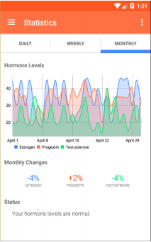

# Pillpal
PillPal is an app that allows women who are new to birth control track their body's response to the pills, as well as manage daily reminders and refill delivery services.

## Group 2 Members

Hamza Ahmed,
Joshua Meeker,
Jessica Zhuge,
Unzi Park,
and Albert Jo.

## Demo Video

See [our demo video] (https://www.youtube.com/watch?v=1u4881PX78M&list=PLbok9t2URfW0de5E9PXyBXX1__gp1gXpM&index=9)

## Mobile Screenshots

## Wear Screenshots

## Acknowledgments
* MPChart
* PagerSlidingTabStrip
* StackOverflow for tons of help + DB implementation
* Catnip (CS160 Staff)